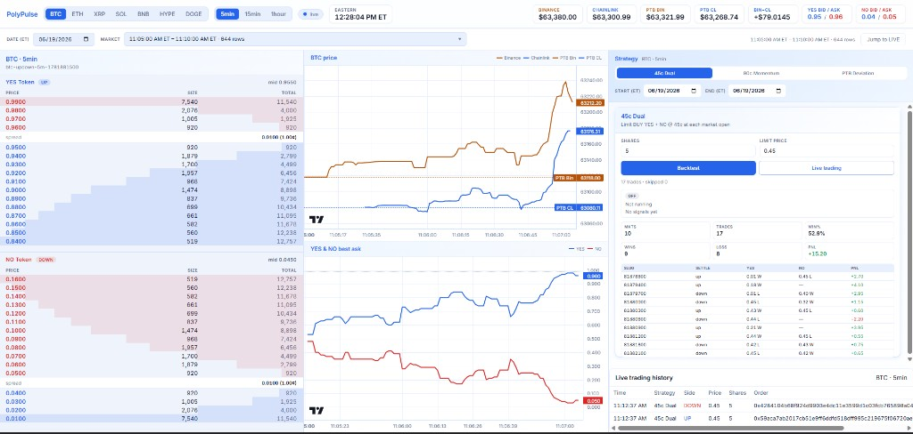
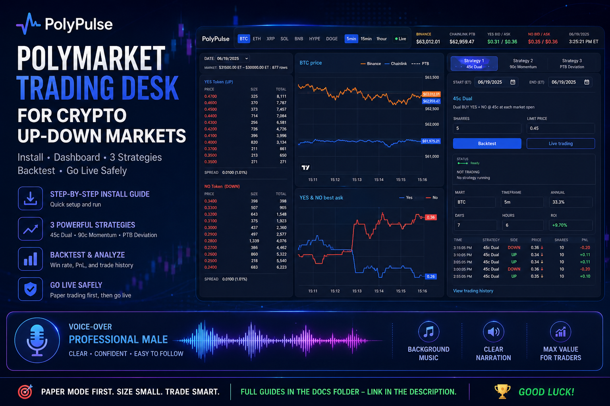

# PolyPulse — Advanced Polymarket Trading Bot & Arbitrage Platform

> **A powerful Polymarket bot for automated trading, arbitrage opportunities, and strategy backtesting on crypto prediction markets**

[English](#english) | [中文](#中文)

---

## English

**PolyPulse** is a professional-grade Polymarket trading bot and arbitrage platform for crypto up/down markets. This Polymarket bot collects live prices and order books, displays real-time charts on a web dashboard, runs strategy backtests, and executes real orders on Polymarket prediction markets.

Whether you're looking for a Polymarket arbitrage bot or an automated trading solution, PolyPulse provides everything you need to trade crypto prediction markets efficiently.

**Key Features of This Polymarket Bot:**
- ✅ **Automated Trading** — Execute trades on Polymarket automatically
- ✅ **Arbitrage Detection** — Identify and execute Polymarket arbitrage opportunities  
- ✅ **Live Market Data** — Real-time price feeds from Binance and Chainlink
- ✅ **Strategy Backtesting** — Test trading strategies on historical data
- ✅ **Web Dashboard** — Monitor positions and trading history in real-time
- ✅ **Multiple Strategies** — 45c Dual, 90c Momentum, PTB Deviation

**Supported Assets:** **BTC, ETH, XRP, SOL, BNB, HYPE, DOGE**  
**Supported Timeframes:** **5m, 15m, 1h**

## Dashboard preview



This Polymarket bot dashboard provides real-time monitoring of your positions and trading activity.

---

## Media Gallery




**Video walkthrough:**  

https://github.com/user-attachments/assets/bebcd35a-fa87-4dea-b78e-86d67be01e10


---

## What you get

This Polymarket trading bot comes with all essential components:

| Component | What it does |
|-----------|----------------|
| **Collector** | Streams Binance prices, Chainlink PTB, and Polymarket CLOB books → saves to `./data/` |
| **Trading Dashboard** | Web UI at port **3003** — charts, strategies, live trading for your Polymarket bot |
| **Built-in Strategies** | 45c Dual, 90c Momentum, PTB Deviation (backtest + live execution) |

---— Deploy Your Polymarket Bot (5 minutes)

Get your Polymarket trading bot running in 5 minutes:

**Requirements:** Node.js 20+, npm, internet access.

```bash
# 1. Go to project folder (Polymarket bot setup)
cd polymarket-multi-tool-ts   # or your clone path

# 2. Create config for your Polymarket bot
cp .env.example .env

# 3. Install & build the Polymarket trading bot
npm install
npm run build

# 4. Run your Polymarket bot with collector + dashboard
npm run dev
```

Open **http://localhost:3003** in your browser.

You should see **PolyPulse Polymarket bot** with live charts after ~10–30 seconds (collector needs time to connect feeds).

---

## Full beginner guide — Learn to Use Your Polymarket Arbitrage Bot

Follow these docs **in order** if you are new:

| Step | Document | You will learn |
|------|----------|----------------|
| 1 | [Installation](docs/01-installation.md) | Prerequisites, install, build |
| 2 | [First run](docs/02-first-run.md) | Start/stop, verify everythin(arbitrage, momentum, deviation) |
| 5 | [Live trading](docs/05-live-trading.md) | Wallet setup, execute real orders, tradingug picker |
| 4 | [Strategies](docs/04-strategies.md) | Backtest all 3 strategies |
| 5 | [Live trading](docs/05-live-trading.md) | Wallet setup, real orders, history |
| 6 | [Configuration](docs/06-configuration.md) | Every `.env` variable explained |
| 7 | [Production & data](docs/07-production-and-data.md) | PM2, data files, API |
| 8 | [Troubleshooting](docs/08-troubleshooting.md) | Common errors and fixes |

Start here: **[docs/README.md](docs/README.md)**

---

## npm scripts

| Command | Description |
|---------|-------------|
| `npm run dev` | Build shared package + run collector & dashboard (development) |
| `npm run collector` | Collector only |
| `npm run dashboard` | Dashboard only |
| `npm run build` | Compile all TypeScript packages |
| `npm run collector:prod` | Run compiled collector |
| `npm run dashboard:prod` | Run compiled dashboard |

---

## Use Cases for This Polymarket Bot

- **Arbitrage Trading** — Monitor Polymarket spread vs. Binance and execute profitable arbitrage trades
- **Market Making** — Use the 45c Dual strategy to capture market spreads on prediction markets
- **Momentum Trading** — Trade on Binance price momentum signals in Polymarket prediction markets
- **Strategy Research** — Backtest custom trading strategies on historical Polymarket data
- **24/7 Automation** — Deploy your Polymarket bot on a server for round-the-clock trading

---

## Polymarket Bot Advantages

✅ **Fully Open-Source** — Transparent, auditable code for your Polymarket trading bot  
✅ **Real-Time Data** — Binance prices + Chainlink feeds for accurate arbitrage detection  
✅ **Backtesting Engine** — Test strategies before risking capital  
✅ **Live Trading** — Execute real orders directly on Polymarket  
✅ **Web Dashboard** — Monitor your Polymarket bot's performance in real-time  
✅ **Developer Friendly** — TypeScript, modular architecture, easy to extend

---

## Project layout

```
polymarket-multi-tool-ts/
├── .env                 # Your secrets & settings (create from .env.example)
├── .env.example         # Template
├── docs/                # Step-by-step guides
├── data/                # JSONL market data (created at runtime)
├── packages/
│   ├── shared/          # Config, types, market discovery
```

---

## 中文

**PolyPulse** 是一个专业级的 Polymarket 交易机器人和套利平台，专为加密货币涨跌市场设计。这款 Polymarket 机器人收集实时价格和订单簿，在网页仪表板上显示图表，运行策略回测，并可以在 Polymarket 预测市场上执行真实订单。

如果你正在寻找 Polymarket 套利机器人或自动化交易解决方案，PolyPulse 提供了一切你需要的功能来高效地交易加密预测市场。

**本 Polymarket 交易机器人的主要功能：**
- ✅ **自动化交易** — 自动在 Polymarket 上执行交易
- ✅ **套利检测** — 识别并执行 Polymarket 套利机会
- ✅ **实时市场数据** — 来自币安和 Chainlink 的实时价格数据流
- ✅ **策略回测** — 在历史数据上测试交易策略
- ✅ **网页仪表板** — 实时监控头寸和交易历史
- ✅ **多个策略** — 45c 双重、90c 动量、PTB 偏差

**支持资产：** **BTC, ETH, XRP, SOL, BNB, HYPE, DOGE**  
**支持时间框架：** **5分钟, 15分钟, 1小时**

### 仪表板预览


本 Polymarket 机器人仪表板提供了对你的头寸和交易活动的实时监控。

---

### 功能概览

本 Polymarket 交易机器人包含所有必要的组件：

| 组件 | 功能 |
|-----------|----------------|
| **Collector** | 流式传输币安价格、Chainlink PTB 和 Polymarket CLOB 订单簿 → 保存到 `./data/` |
| **交易仪表板** | 网页 UI 端口 **3003** — 图表、策略、你的 Polymarket 机器人的实时交易 |
| **内置策略** | 45c 双重、90c 动量、PTB 偏差（回测 + 实时执行） |

---

### 快速开始 — 部署你的 Polymarket 机器人（5分钟）

在 5 分钟内运行你的 Polymarket 交易机器人：

**要求：** Node.js 20+、npm、互联网连接。

```bash
# 1. 进入项目文件夹（Polymarket 机器人设置）
cd polymarket-multi-tool-ts   # 或你的克隆路径

# 2. 为你的 Polymarket 机器人创建配置
cp .env.example .env

# 3. 安装并构建 Polymarket 交易机器人
npm install
npm run build

# 4. 运行你的 Polymarket 机器人 collector + dashboard
npm run dev
```

在浏览器中打开 **http://localhost:3003**。

大约 10-30 秒后，你应该看到 **PolyPulse Polymarket 机器人**显示实时图表（collector 需要时间连接数据源）。

---

### 完整初学者指南 — 学习使用你的 Polymarket 套利机器人

| 步骤 | 文档 | 你将学到 |
|------|----------|----------------|
| 1 | [安装](docs/01-installation.md) | 前置条件、安装、构建 |
| 2 | [首次运行](docs/02-first-run.md) | 启动/停止、验证一切正常 |
| 3 | [仪表板指南](docs/03-dashboard.md) | 图表、币种/时间框架、slug 选择器 |
| 4 | [策略](docs/04-strategies.md) | 回测所有 3 个策略（套利、动量、偏差） |
| 5 | [实时交易](docs/05-live-trading.md) | 钱包设置、执行真实订单、交易历史 |
| 6 | [配置](docs/06-configuration.md) | 每个 `.env` 变量解释 |
| 7 | [生产和数据](docs/07-production-and-data.md) | PM2、数据文件、API |
| 8 | [故障排除](docs/08-troubleshooting.md) | 常见错误和修复 |

从这里开始：**[docs/README.md](docs/README.md)**

---

### npm 脚本

| 命令 | 描述 |
|---------|-------------|
| `npm run dev` | 构建共享包 + 运行 collector 和 dashboard（开发模式） |
| `npm run collector` | 仅运行 Collector |
| `npm run dashboard` | 仅运行 Dashboard |
| `npm run build` | 编译所有 TypeScript 包 |
| `npm run collector:prod` | 运行编译的 collector |
| `npm run dashboard:prod` | 运行编译的 dashboard |

---

### Polymarket 机器人的使用场景

- **套利交易** — 监控 Polymarket 差价与币安价格，执行盈利的套利交易
- **做市交易** — 使用 45c 双重策略在预测市场上捕获市场点差
- **动量交易** — 根据币安价格动量信号在 Polymarket 预测市场上交易
- **策略研究** — 在历史 Polymarket 数据上回测自定义交易策略
- **24/7 自动化** — 在服务器上部署你的 Polymarket 机器人进行全天交易

---

### Polymarket 交易机器人的优势

✅ **完全开源** — 透明、可审计的 Polymarket 交易机器人代码  
✅ **实时数据** — 币安价格 + Chainlink 数据源用于准确的套利检测  
✅ **回测引擎** — 在冒风险之前测试策略  
✅ **实时交易** — 直接在 Polymarket 上执行真实订单  
✅ **网页仪表板** — 实时监控你的 Polymarket 机器人的性能  
✅ **开发者友好** — TypeScript、模块化架构、易于扩展

---

### 项目布局

```
polymarket-multi-tool-ts/
├── .env                 # 你的密钥和设置（从 .env.example 创建）
├── .env.example         # 模板
├── docs/                # 分步指南
├── data/                # JSONL 市场数据（运行时创建）
├── packages/
│   ├── shared/          # 配置、类型、市场发现
│   ├── collector/       # Live data feeds
│   ├── dashboard/       # API + web UI
│   └── strategies/      # Backtest engines
├── ecosystem.config.js  # PM2 config for 24/7 runs
└── package.json
```

---

## Safety note

- Start with **`LIVE_TRADING_ENABLED=false`** in `.env` until you understand paper mode.
- Live trading uses real money on Polymarket. Read [Live trading](docs/05-live-trading.md) before enabling it.
- Never commit `.env` or share your private key.

---

## Need help?

1. Check [Troubleshooting](docs/08-troubleshooting.md)
2. Verify collector is running: terminal should show `PolyPulse collector starting`
3. Check trading status: `curl http://localhost:3003/api/trading/status`
